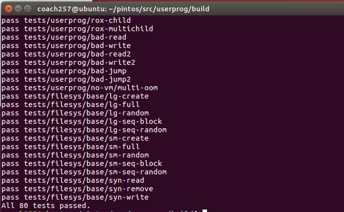
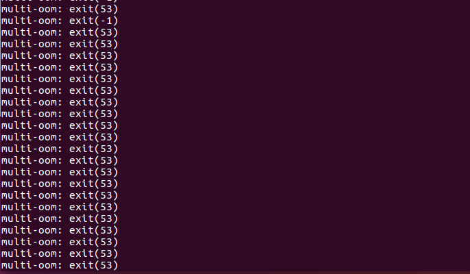
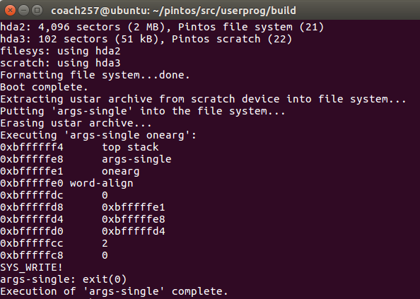

# PROJECT 2: USER PROGRAMS DESIGN DOCUMENT

[TOC]

## 1. GROUP

> Fill in the names and email addresses of your group members.

| NAME | SID | MAIL | RATIO |
| - | - | - | - |
| 朱英豪 | 18373722 | 18373722@buaa.edu.cn | 25% |
| 施哲纶 | 18373044 | 18373044@buaa.edu.cn | 25% |
| 胡鹏飞 | 18373059 | 18373059@buaa.edu.cn | 25% |
| 朱晨宇 | 18373549 | 18373549@buaa.edu.cn | 25% |

> 主要负责内容

| NAME | RESPONSIBLE FOR |
| - | - |
| 朱英豪 | 需求、思路设计；文档编写 |
| 施哲纶 | 具体算法实现；文档审核 |
| 胡鹏飞 | 项目前期调研；理解Pintos |
| 朱晨宇 | 负责Debug，代码风格检查 |

> Github记录


> 样例通过情况

All 80 tests passed：



multi-oom测试：题目要求创建至少30个进程，我们实现了53个。


## 2. PRELIMINARIES

> If you have any preliminary comments on your submission, notes for the TAs, or extra credit, please give them here.

我们该项目的Github仓库为私有仓库，如有需要，请联系我们。

> Please cite any offline or online sources you consulted while preparing your submission, other than the Pintos documentation, course text, lecture notes, and course staff.

1. 操作系统概念(原书第9版)/(美)Abraham Silberschatz等著
2. 原仓周老师PPT中的概念和课上讲解

## 3. QUESTION 1: ARGUMENT PASSING

### 3.1. 需求分析

此部分为参数传递部分。

总体上来考察本次Project2的第一部分的需求分析，本组成员发现：在本次Pintos实验中，项目需要能够通过输入的命令以及参数，相对应的执行不同部分的代码，以完成相对不同的功能以及作用。面对这样的需求，需要尽可能地将相对应的命令以及参数传递到项目中处理命令和参数内容的代码段处。

具体地考察这一部分（参数传递部分）的需求。目前，`process_execute()`不支持将参数传递给新进程。本项目需要通过扩展实现此功能(能够通过`process_execute()`传递参数给新的进程)。由于参数的输入，是通过字符串的形式输入的，并且在不同参数之间，用空格分隔。同时，需要注意的是，参数之间用来分隔的空格，并不一定是单个空格，也有可能是多个空格。但在参数分隔中，连续的多个空格，同时等效于单个空格的分隔效果。在输入的命令行中，第一个单词是程序名称，也就是对应的命令名称，第二个单词是第一个参数，第三个单词是第二个参数，...，以此类推。也就是说，举一个例子`process_execute("grep foo bar")`应该运行 `grep`，随后传递两个参数`foo`和`bar`。

本组在该部分所需要完成的就是修改`process_execute()`，使之具备能够读取文件名，以及读取不同长度参数，并分析不同参数的功能。

### 3.2. 设计思路

参数传递部分的代码主要分布在`src/userprog/process.c`文件中。

在设计思路上，参数传递部分的主要思想相对简单。参数传递的主要设计思想就是将输入的命令行读入进来，初步分为命令/文件名和参数两大部分。随后通过空格分隔符，将参数进一步分隔为不同的参数1、参数2、参数3……按照文档中的要求，依次放入栈中。

最终效果如下图所示：



### 3.3. DATA STRUCTURES

> A1: Copy here the declaration of each new or changed `struct` or `struct` member, global or static variable, `typedef`, or enumeration.  Identify the purpose of each in 25 words or less.

在本部分中，添加的新的数据结构或者是修改已有的数据结构。有：

**in `thread.h`**

- [NEW] `struct list child_list`
  - 定义子进程列表来储存父进程的所有子进程
- [NEW] `struct list_elem cpelem`
  - 定义`child_list`的`elem`
- [NEW] `tid_t parent_tid`
  - 定义父进程的`tid`

**in `process.c`**

- [CHANGED] `process_execute()`
  - implement starts a new thread running a user program loaded from FILENAME.
- [CHANGED] `start_process()`
  - implement 参数传递

### 3.4. ALGORITHMS

> A2: Briefly describe how you implemented argument parsing.  How do you arrange for the elements of argv[] to be in the right order? How do you avoid overflowing the stack page?
>
> A2: 简要描述你是怎么实现Argument parsing的。你是如何安排argv[]中的elements，使其在正确的顺序的？你是如何避免stack page的溢出的？

- 第一个部分是参数解析Argument Parsing的问题：

`process_execute()`提供的`file_name`包括了命令command和arguments string。首先，我们先将第一个token和其他剩余部分分开来，这样就分成了两部分，分别为程序名和参数串。然后，创建新的thread，其名字为分离出的第一个token。

当设置stack的时候，优先将参数放到栈顶，并且记录参数对应的地址。随后将每个token的地址依次压入栈中。其中包括`word align`、`argv[argc]`、`argv[]`、`argc`、`return addr`等。

- 第二个部分是避免堆栈页面溢出的问题：

我们在实施之前并没有预先计算出所需要的空间。但是，我们在实际处理溢出的时候，采用了这种办法：就是在每次使用esp之前，检查esp的有效性，并且检查所需参数所指的地址的有效性。

### 3.5. RATIONALE

> A3: Why does Pintos implement strtok_r() but not strtok()?
>
> A3: 为什么Pintos中实现strtok_r()而不是strtok()？

`strtok_r()`和`strtok()`之间的唯一区别就是`save_ptr()`。`save_ptr()`在`streak_r()`中提供了一个占位符。在Pintos中，内核可以将命令行分为命令/文件名和参数串两个部分，所以我们需要把参数的地址存放在之后可以获取到的地方。

> A4: In Pintos, the kernel separates commands into a executable name and arguments.  In Unix-like systems, the shell does this separation.  Identify at least two advantages of the Unix approach.
>
> A4: 在Pintos中，kernel将命令分成了可执行文件的name以及参数。在Unix-like的系统中，shell完成这部分的分隔。列举至少2种Unix这样做的好处。

第一个好处是，这可以缩短内核内部运行的时间。

第二个好处是，这可以在讲命令传递给下一部分程序之前，检查参数是否超过限制以避免kernel fail。

第三点好处是，分离参数和命令以便于进行更高级的预处理。

## 4. QUESTION 2: SYSTEM CALLS

### 4.1. 需求分析

初始Pintos中已经有了支持加载和运行用户程序的功能，但是没有与用户进行I/O交互的功能，所以我们需要完善我们的代码来实现用户可以通过命令行的形式来运行自己想要运行的程序，并且可以在命令行中传入一定的参数来实现交互。

在之前的项目当中，我们直接通过命令行使得程序直接在内核之中编译运行，这显然是不安全的。系统内核涉及到整个操作系统的安全性，尽管在我们的项目当中我们可以轻易地在内核中直接编译，但是提供程序接口给用户，来实现程序同系统直接按的通信是十分有必要的。典型的系统调用有`halt`, `exit`, `exec`, `wait`, `create`, `remove`, `open`, `filesize`, read, write, `seek`, `tell`, `close`等，这些也是文档中要求我们完成的部分。

### 4.2. 设计思路

通过阅读Pintos操作系统的官方文档，我们可以知道系统调用时会传入参数`f`，其类型为`struct intr_frame`，并且该指针的解引用的值为`lib/syscall-nr.h`中已经定义好的枚举变量，我们需要根据不同的枚举变量来执行不同的函数，所以这里采用一个switch选择器进行选择是十分合理的。

对于不同的函数系统调用函数而言，我们第一步的工作都是根据不同的指针类型对传入的值进行检查，所以需要先写出检查函数`pointer_valid`和`char_pointer_valid`对传入的不同类型的参数进行检查。在打开文件时创建结构体`struct file f`来保存`fd`的值和文件名，所以该结构体中至少保存有文件描述符的`num`和文件名，又因为一个文件可能打开多个文件，所以该结构要作为列表中的元素，所以结构体中还应该有`list_elem`元素，并将`elem`存入当前线程的`fd_list`。

在`read`, `filesize`, `write`, `tell`, `close`, `seek`系统调用时，都需要根据`fd->num`来获取`fd`，这促使我们将这一过程抽象成函数`find_fd_by_num(int num)`函数，以方便我们对代码进行检查。在执行系统调用函数之后，仍然需要对传入的参数进行检查空指针和个数检查，这就促使我们将每一个系统调用函数拆分成两部分:第一部分为检查参数部分，而第二部分为具体的执行代码，使得结构整体上十分清晰。具体的系统调用函数参照官方文档所述进行编写即可。

### 4.3. DATA STRUCTURES

> B1: Copy here the declaration of each new or changed `struct` or `struct` member, global or static variable, `typedef`, or enumeration.  Identify the purpose of each in 25 words or less.

**全局变量**

- [NEW] `struct lock file_lock`
  - 定义文件锁来限制多个线程同时修改同一个文件
- [NEW] `typedef int pid_t`
  - 定义线程标识号的类型
- [NEW] `int fd_num`
  - 定义非负整数file descriptor
- [NEW] `struct fd`
  - 定义新的结构体来表示一个线程打开的文件
- [NEW] `struct thread* parent`
  - 表示线程的父进程

**in `struct thread`**

- [NEW] `struct list fd_list`
  - 表示线程拥有的fd列表
- [NEW] `struct list fd_list`
  - 表示线程拥有的fd列表
- [NEW] `struct list child_status`
  - 表示子进程状态列表
- [NEW] `struct file *execfile`
  - 表示线程正在执行的文件
- [NEW] `struct child_process_status *relay_status`
  - 表示转发给父进程的子进程状态
- [NEW] `struct semaphore sema`
  - 表示子进程等待的信号量

**in `struct child_process_status`**

- [NEW] `struct int ret_status`
  - 表示子进程的返回状态
- [NEW] `struct int tid`
  - 表示子进程的tid
- [NEW] `struct thread* child`
  - 表示指向子进程的指针
- [NEW] `bool finish`
  - 表示子进程是否完成的状态
- [NEW] `bool iswaited`
  - 表示子进程是否等待的状态
- [NEW] `bool loaded`
  - 表示子进程是否等待的状态
- [NEW] `struct list_elem elem`
  - 表示子进程状态结构体的列表元素

> B2: Describe how file descriptors are associated with open files. Are file descriptors unique within the entire OS or just within a single process?
>
> B2: 描述文件描述符是如何与打开文件相联系的。文件描述符是在整个中唯一还是仅在单个进程中唯一？

文件描述符通过维护一个唯一的非负整数且不为0和1的方法来对文件进行联系。我们需要保存文件和`fd`之间对应关系，这就促使我们将其打包成一个结构体。同时使打开的文件是属于某个进程的，这就需要我们来定义一个列表来对这个整体进行维护，同时在整体中出入`struct list_elem elem`元素即可实现列表。文件描述符在整个OS中都是唯一的，因为我们这里在`syscall.c`中维护一个起始值为2的全局变量(0和1是console)，每一次打开一个文件就`fd`加1，这样就简单实现了文件描述符的唯一性。

### 4.4. ALGORITHMS

> B3: Describe your code for reading and writing user data from the kernel.
>
> B3: 描述你用来从kernel中读写文件的代码。

主要在`sys call.c`中：

```cpp
void 
syscall_read(struct intr_frame *f){
  if(!pointer_valid(f->esp+4,3)){
    exit(-1);
  }
  int fd = *(int*)(f->esp+4);
  void *buffer = *(char**)(f->esp+8);
  unsigned size = *(unsigned*)(f->esp+12);
  if(!char_pointer_valid(buffer)){
    exit(-1);
  }
  lock_acquire(&file_lock);
  f->eax = read(fd,buffer,size);
  lock_release(&file_lock);
}
```

```cpp
int 
read(int num,void *buffer,unsigned size){
  /* Fd 0 reads from the keyboard using input_getc(). */
  if(num == 0){
    int i;
    for(i=0;i<size;i++){
      (*((char**)buffer))[i] = input_getc();
    }
    return size;
  }
  struct fd* fd = find_fd_by_num(num);
  if(fd == NULL){
    return -1;    
    /* -1 if the file could not be read (due to a condition other than end of file) */
  }
  return file_read(fd->file,buffer,size);
}
```

在`process.c`中：

```c++
bool
load (const char *file_name, void (**eip) (void), void **esp) {
  struct thread *t = thread_current ();
  struct Elf32_Ehdr ehdr;
  struct file *file = NULL;
  off_t file_ofs;
  bool success = false;
  int i;

  /* Allocate and activate page directory. */
  t->pagedir = pagedir_create ();
  if (t->pagedir == NULL) 
    goto done;

  process_activate ();
  /* Open executable file. */
  lock_acquire(&file_lock);
  file = filesys_open (file_name);
  if (file == NULL) 
    {
      printf ("load: %s: open failed\n", file_name);
      goto done; 
    }
  /* Read and verify executable header. */
  if (file_read (file, &ehdr, sizeof ehdr) != sizeof ehdr
      || memcmp (ehdr.e_ident, "\177ELF\1\1\1", 7)
      || ehdr.e_type != 2
      || ehdr.e_machine != 3
      || ehdr.e_version != 1
      || ehdr.e_phentsize != sizeof (struct Elf32_Phdr)
      || ehdr.e_phnum > 1024) 
    {
      printf ("load: %s: error loading executable\n", file_name);
      goto done; 
    }
  /* Read program headers. */
  file_ofs = ehdr.e_phoff;
  for (i = 0; i < ehdr.e_phnum; i++) 
    {
      struct Elf32_Phdr phdr;

      if (file_ofs < 0 || file_ofs > file_length (file))
        goto done;
      file_seek (file, file_ofs);

      if (file_read (file, &phdr, sizeof phdr) != sizeof phdr)
        goto done;
      file_ofs += sizeof phdr;
      switch (phdr.p_type) 
        {
        case PT_NULL:
        case PT_NOTE:
        case PT_PHDR:
        case PT_STACK:
        default:
          /* Ignore this segment. */
          break;
        case PT_DYNAMIC:
        case PT_INTERP:
        case PT_SHLIB:
          goto done;
        case PT_LOAD:
          if (validate_segment (&phdr, file)) 
            {
              bool writable = (phdr.p_flags & PF_W) != 0;
              uint32_t file_page = phdr.p_offset & ~PGMASK;
              uint32_t mem_page = phdr.p_vaddr & ~PGMASK;
              uint32_t page_offset = phdr.p_vaddr & PGMASK;
              uint32_t read_bytes, zero_bytes;
              if (phdr.p_filesz > 0)
                {
                  /* Normal segment.
                     Read initial part from disk and zero the rest. */
                  read_bytes = page_offset + phdr.p_filesz;
                  zero_bytes = (ROUND_UP (page_offset + phdr.p_memsz, PGSIZE)
                                - read_bytes);
                }
              else 
                {
                  /* Entirely zero.
                     Don't read anything from disk. */
                  read_bytes = 0;
                  zero_bytes = ROUND_UP (page_offset + phdr.p_memsz, PGSIZE);
                }
              if (!load_segment (file, file_page, (void *) mem_page,
                                 read_bytes, zero_bytes, writable))
                goto done;
            }
          else
            goto done;
          break;
        }
    }
  /* Set up stack. */
  if (!setup_stack (esp))
    goto done;

  /* Start address. */
  *eip = (void (*) (void)) ehdr.e_entry;
  success = true;

 done:
  /* We arrive here whether the load is successful or not. */
  if(success)
  {
    t->execfile = file;
    file_deny_write(file);
  }
  else
  {
    file_close(file);
  }
  lock_release(&file_lock);
  return success;
}
```

系统调用读写文件的功能时，首先进入`syscall_read()`函数：

首先要检查`buffer` , `f`和 `buffer+size` 是否是合法的指针，如果不是直接调用`exit(1)`退出。检查完毕之后获取文件锁`file_lock`, 执行`read()`函数，并将其返回值赋给`f->eax`，读取完毕之后释放文件锁。

`read()`函数首先要判断传入的第一个参数`num`。`num`如果为0则代表需要用户进行输入，并将其读入到`buffer`指向的地址当中；否则便根据`num`值去寻找对应的文件描述如果文件描述为空，即没有找到这样的文件描述符，则返回`-1`，否则执行已经写好的`file_read`函数并返回该函数的返回值。

> B4: Suppose a system call causes a full page (4,096 bytes) of data to be copied from user space into the kernel.  What is the least and the greatest possible number of inspections of the page table (e.g. calls to pagedir_get_page()) that might result?  What about for a system call that only copies 2 bytes of data?  Is there room for improvement in these numbers, and how much?
>
> B4: 假设一个系统调用造成一整页的数据(4096 bytes)从用户空间复制到kernel。
>
> 求可能造成的最小和最大的页表的检查次数。(e.g. 对pagedir_get_page()的调用)。如果系统调用只copy了2 bytes的数据呢？还有没有空间优化？可以优化多少？

对于整页的数据而言：最小的数字是1，如果第一次检查就获得了页的头指针，那么我们就可以从返回的地址中推断出，我们不需要再进行任何的检查，它能获得一整页的数据；最大的数字是4096，如果它不是连续的，我们必须检查每一个地址来保证用户进程拥有合法的权限。当它是连续时，最大的数字为2，如果我们获得一个不是页头指针的虚拟地址，我们一定要检查开始指针和结束指针，查看它们是否映射。

对于两字节的数据而言：最小的数字时1，如上文所述，如果我们获得了一个大于2字节的地址空间，我们显然并不需要再做任何的检查。最大数字也是2，如果它时不连续的或者他是不连续的（返回页表的末尾），进行另一次检查也是十分有必要的。

综上所述，我们认为没有优化的空间。

> B5: Briefly describe your implementation of the "wait" system call and how it interacts with process termination.
>
> B5: 简要描述你"wait"系统调用的实现以及它是如何与进程停止交互的。

在我们文档之后的部分：[**核心：进程同步**](#核心进程同步)中详细介绍了这一部分。简要来说，我们引入了信号量来上锁、`iswaited`来判断进程是否被等、`finish`来判断进程当前是否已结束等数据结构，并对`loaded`的状态进行了严谨的判断，对僵死进程亦作了处理，保证了当出错时与进程停止交互，实现了`wait`同步。

当系统调用是`SYS_WAIT`类型时，首先进入函数`syscall_wait`函数，对出入的`f`变量的值进行检查，检查通过之后调用`wait`函数。

```cpp
void 
syscall_wait(struct intr_frame *f){
   if(!pointer_valid(f->esp+4,1)
    exit(-1);
  
  pid_t pid = *(int*)(f->esp+4);
  f->eax = wait(pid)
}
```

`wait()`函数中直接返回`process_wait()`函数的返回值即可，具体的实现方法已经在`process_wait()`中实现，这里就不再赘述了。

> B6: Any access to user program memory at a user-specified address can fail due to a bad pointer value.  Such accesses must cause the process to be terminated.  System calls are fraught with such accesses, e.g. a "write" system call requires reading the system call number from the user stack, then each of the call's three arguments, then an arbitrary amount of user memory, and any of these can fail at any point.  This poses a design and error-handling problem: how do you best avoid obscuring the primary function of code in a morass of error-handling?  Furthermore, when an error is detected, how do you ensure that all temporarily allocated resources (locks, buffers, etc.) are freed?  In a few paragraphs, describe the strategy or strategies you adopted for managing these issues.  Give an example.
>
> 任何在用户指定的地址上对用户程序的内存的访问可能因为指针错误而失败。此类访问一定导致进程终止。系统调用充满了这样的访问。如一个“写”系统调用需要先从用户栈中读系统调用号，然后每一个调用的3个参数，然后是任意数量的用户内存。任何这些都可能造成失败。这构成一个设计错误处理的问题：如何最好地避免混淆主要错误处理的烦恼？此外，当错误被检查到，你如何保证所有的临时开出的资源（锁、缓冲区等）都被释放？用几段话来描述你处理这些问题的策略。

在我们代码当中，系统调用所传入的第一个参数`f`首先要进行是否是空的检查，然后再根据不同的系统调用去检查传参位置是否为合法的。在`process.c`中的`load`函数中：函数返回之前会进行锁释放，而在执行函数期间，如果出现了不合法的指针的时候，我们都要直接跳到函数的最后进行资源释放，然后返回相应的值，这样就避免了锁资源都被释放。

在`syscall_write`函数中，我们有如下结构：

```c
  lock_acquire(&file_lock);
  f->eax = write(fd,buffer,size);
  lock_release(&file_lock);
```

这就保证了执行完write操作后一定能够把锁释放掉。

### 4.5. SYNCHRONIZATION

> B7: The "exec" system call returns -1 if loading the new executable fails, so it cannot return before the new executable has completed loading.  How does your code ensure this?  How is the load success/failure status passed back to the thread that calls "exec"?
>
> B7: 如果新的可执行文件加载失败，"exec"系统调用会返回-1，所以它不能够在该新的可执行文件成功加载之前返回。你的代码是如何保证这一点的？加载成功/失败的状态是如何传递回调用"exec"的线程的？

在我们文档之后的部分：[**核心：进程同步**](#核心进程同步)中详细介绍了这一部分。简要来说，我们是利用信号量来保证可执行文件加载失败后在新的可执行文件成功加载之后返回。这一部分的问题，我们主要在`process.c`里实现。当我们读入了命令，经过参数传递等一系列操作，需要创建一个新的可执行文件/线程之时，在创建完成之后，我们用信号量将其阻塞，等待子进程loaded。在子进程加载完成之前，`child_status->loaded=0`；如果子进程加载失败，则`child_status->loaded=-1`；如果子进程加载成功，则`child_status->loaded=1`。

```cpp
while(child_status->loaded == 0)
{
  sema_down(&thread_current()->sema);
  /* 阻塞，等待子进程执行完loaded */
}
if(child_status->loaded == -1)
/* 子进程已经加载完毕 */
{
  return -1;
}
```

而在子进程这一边。`start_process`中，我们利用`success`来传递子进程是否加载成功。

如果加载不成功，则在`sema_up()`之前，将`load`赋值为-1.

```cpp
/* 加载用户进程的eip和esp eip:执行指令地址 esp:栈顶地址 */
success = load (token, &if_.eip, &if_.esp);

/* If load failed, quit. */
if (!success)
{
  thread_current()->relay_status->loaded = -1;
  sema_up(&thread_current()->parent->sema);
  exit(-1);
}
```

如果加载成功，则`load`赋值为1.

```cpp
thread_current()->relay_status->loaded = 1;
sema_up(&thread_current()->parent->sema);
```

> B8: Consider parent process P with child process C.  How do you ensure proper synchronization and avoid race conditions when P calls wait(C) before C exits?  After C exits?  How do you ensure that all resources are freed in each case?  How about when P terminates without waiting, before C exits?  After C exits?  Are there any special cases?
>
> B8: 考虑有父进程P和它的子进程C。当P在C exit之前调用wait(C)时，你如何确保同步以及如何避免争用的情况？你如何确保在每种情况下，所有的资源都被释放？如果P在C exit之前，没有waiting便终止？如果在C exit之后？有什么特殊情况吗？

我们通过在线程之中维护一个`child_process_status`类型的指针，用以记录进程的状态，如果直接放在`thread`结构体中，进程被释放之后所有信息都被释放，此时父进程`wait`子进程会发现Pid对应的线程已经被释放，也就会发生错误，所以一定要重新定义一个结构体来记录线程的一些需要保留的状态。

有以下几种情况：

- P在C退出之前调用`wait()`函数
  - P会一直等待C结束并获取C的退出状态
- P在C退出之后调用`wait()`函数
  - 在`child_process_status`保存有C的退出状态，直接获取C的退出状态
- P终止而不等待C退出
  - 父进程中的所有的文件描述符的列表清空，并设置自己的`relay_status`和释放掉`child_status`中的所有元素。
  - 子进程退出之后会修改自己的`status`，此时会忽略父进程是否还在等待。

在C exit之后，没有特殊情况，因为C exit之后会释放其拥有的所有资源并且设置线程对应的`status`结构体中的元素。

### 4.6. RATIONALE

> B9: Why did you choose to implement access to user memory from the kernel in the way that you did?
>
> B9: 为什么你使用这种方式来实现从内核对用户内存的访问？

因为如果不对传入的参数进行层层检查，用户程序很有可能造成Kernel Panic从而导致整个系统的崩溃。在深刻理解了传入参数的实际意义之后我们进行了严格的检查从而实现了内核对用户内存的访问。

> B10: What advantages or disadvantages can you see to your design for file descriptors?
>
> B10: 你对文件描述符的设计有什么优劣吗？

优势：

- 可以在整个操作系统中使用独一无二的`fd_num`。
- 减少了`struct thread`在栈中所占有的空间。

劣势：

- 如果打开的文件太多，可能会造成`fd_num`溢出。

> B11: The default tid_t to pid_t mapping is the identity mapping. If you changed it, what advantages are there to your approach?
>
> B11: 默认的tid_t到pid_t的映射是identity mapping。如果你进行了更改，那么你的方法有什么优点？

我们没有对以上映射修改。

## 5. 核心：文件同步

### 5.1. 解决思路

当不同的用户试图对同一个文件进行修改的时候，可能会发生混乱，这就需要我们对文件进行同步。简单来讲，有两种文件同步的方法：一种是实现不同用户之间的文件同步，类似于网上的共享文档一样；第二种就是当一个用户进程正在写一个文件，直接禁止其他用户对文件进行修改或者删除等等。在这里我们通过锁来实现第二种方法。

### 5.2. 关键代码解析

以下是创建文件的代码：

```cpp
void
syscall_create(struct intr_frame *f)
{
  if(!pointer_valid(f->esp+4,2))
  {
    exit(-1);
  }
  char *file = *(char**)(f->esp+4);
  if(!char_pointer_valid(file))
  {
    exit(-1);
  }
  unsigned initial_size = *(int *)(f->esp+8);
  lock_acquire(&file_lock);
  f->eax = create(file,initial_size);
  lock_release(&file_lock);
}
```

可以看到当执行`create`函数之前，回去获取文件锁`file_lock`，当创建完毕之后会释放锁，这就保证了同一时间只有一个用户进程去创建文件。

同样的，在删除文件的这个系统调用中也同样需要先获得锁。

```cpp
void
syscall_remove(struct intr_frame *f)
{
  if(!pointer_valid(f->esp+4,1))
    exit(-1);
  char *file = *(char**)(f->esp+4);
  if(!char_pointer_valid(file))
    exit(-1);
  lock_acquire(&file_lock);
  f->eax = remove(file);
  lock_release(&file_lock);
}
```

同样的，在文件打开、文件关闭、文件长度、读取文件、文件写入、移动文件指针，`tell()`函数中都要首先进行锁获取再进行操作。这就保证了文件之间的同步，因为文件锁是全局变量，整个系统中仅有一个文件锁。

一些系统调用：

```cpp
void syscall_close(struct intr_frame *f)
{
  if(!pointer_valid(f->esp+4,1))
    exit(-1);
  lock_acquire(&file_lock);
  close(fd);
  lock_release(&file_lock);
}
```

通过查阅`lock_acquire()`函数的源代码可以知道锁就是`value`值为1的信号量，而信号量中会有一个线程列表来保留阻塞的线程，直到锁被释放以后列表中的线程才能再次执行。

以上就实现了文件同步的所有过程。

## 6. 核心：进程同步
### 6.1. 解决思路

#### 6.1.1. 初版

在初级版本中，我们考虑到，在进行本项目的过程中，有着进程同步的需求，而这个需求无疑是十分必要的。

因此，我们首先简单地思考了一下进程同步的问题，发现需要一个能够使进程等待的函数，来帮助我们完成进程同步的需求。

本组同学在`process_wait()`中，添加/修改代码。在直观的思维理解中，必然是做出了这样的策略：父进程利用`process_excute()`创建子进程，随后在`process_wait()`中，父进程等待子进程结束，返回子进程的`tid`。

```cpp
 struct thread* child = get_child_by_tid(&thread_current()->child_list,child_tid);
  if(child==NULL)return -1; /* not child_tid */
  int ret = child->ret;
  while(child!=NULL){
    thread_yield();
    child = get_child_by_tid(&thread_current()->child_list,child_tid);
  }
  return ret;
```

这是一种相对来说非常直观并且直接的方法。这种方法用到了一些新的结构。

```cpp
struct list child_list; /* 子进程列表 */
struct list_elem cpelem; /* elem for child_list */
tid_t parent_tid; /* 父进程的tid */
```

当然，这种直观的方法存在某些问题。这些问题和解决这些问题的方法，将在下一部分重构中，详细的讲解。

#### 6.1.2. 重构

考虑以下情况：父进程在成功创建完子进程后，子进程获得了CPU资源，并且执行到底，成功退出，并且调度之后该进程所有信息被释放。此时父进程并没有进入`process_wait()`，那么父进程应该如何获得子进程的退出状态呢？我们考虑使用以下方式来解决这样的问题。对于每一个进程开辟一块新的空间，保存该进程作为子进程传给父进程的子进程状态`child_process_status`。这一状态维护在父进程的`child_status`列表中。子进程退出之后，只释放进程本身的信息，并不释放`child_process_status`中的信息。这样在子进程退出之后，父进程仍然能够在自己的`child_status`列表中找到该子进程的`child_process_status`，获得该子进程的退出信息。

当我们创建一个子进程后，子进程要执行加载，但只有当子进程从`start_process()`运行至`load()`后，我们才知道子进程是否真的加载成功。所以我们要保证子进程要运行至`load()`，才能得知子进程的加载成功与否的状态。需求中提到：如果子进程加载成功，便返回子进程的`tid`；如果子进程加载失败，则返回`-1`。在我们的初版代码中，不管子进程如何，我们都会直接返回。现在我们要想知道子进程是否加载成功，就要在子进程加载完毕后，再去判断其加载是否成功，然后才返回。

我们在重构版本的代码中，`process_wait()`部分改用了信号量来实现：信号量锁在上面，直到子进程执行完`loaded`之后，会在其执行失败时，通过`sema_up()`唤醒父进程；若执行成功，则唤醒父进程，此后父进程便可获取子进程是否加载成功的信息。

考虑以下需求：当`child_tid`不合法，则返回`-1`；当`child_tid`并不是你子进程的`tid`，返回`-1`；另外`child_tid`正在被其他进程等待，则返回`-1`。为了知道进程是否正在被别的进程等待，我们加入了新的数据结构`bool`量`iswaited`，表示进程是否被等。在`process_wait()`中，我们依次判断`child_tid`是否合法。当判断完后，令`iswaited=true`，表明进程处在等待状态。我们亦引入了`bool`量`finish`，表示进程是否已执行完。由于进程可能被多个子进程唤醒，故每次唤醒都要做判断，因此我们使用`while`，而非`if`。当执行完后，子进程不仅要向父进程返回其`status`，为了节省空间，还要把子进程的空间释放掉(`thread.h/struct child_process`)。

对于`process_exit()`：每次`exit`会进入到`syscall.c`中的`exit()`，又会进入到`thread.c`中的`thread_exit()`，其判断若在用户程序中，便会执行`process_exit()`。注意尽管`pagedir_destroy(pd)`，释放掉了进程的页，但`thread.h`中的`struct thread{}`没有被释放(`thread.h`中的`struct thread{}`在`schedule()`中被释放)。所以在`destroy`之后，仍然知道当前`process`的参数的，可以在`process_exit()`的后续来获取一些信息，如可以退出时输出`cur->name`, `cur->ret`。在退出时，亦会移出该进程的所有子进程，此时其所有子进程都会成为僵死进程，先前获取到的子进程的`status`便没有用了，于是遍历，把`child_status`释放。

最后是对僵死进程的处理。由于进程`exit`后，其`finish`置为`true`，要唤醒父亲，如果该进程为僵死进程，它没有父亲，则唤醒父亲的操作会引用出错(指针指向空的区域)，会造成`page fault`。所以每一次释放掉僵死进程所代表的`child`进程时，要将其指向的父进程的空间(`struct thread *parent`)置为`NULL`。这样便可以在`exit`时做判断：如果我有父亲，则唤醒，把需要传递的值赋给`relay_status`，即相当于父进程的`child_status`（我完成了，我的返回状态是什么，再把父亲给唤醒）

### 6.2. 关键代码解析

**in `thread.h`**

```cpp
int loaded;
// 加载成功与否的状态：初始化为0，如果加载成功=1，如果加载失败=-1
bool iswaited;
/* if process_wait() has already
   been successfully called for the given TID, returns -1
   immediately, without waiting. */
bool finish; /* 子进程是否运行结束 */
struct child_process_status *relay_status 
// 传递子进程给父进程的信息。
// 目的是为了父进程若未退出，而子进程却退出了，使子进程退出时，子进程的相关信息仍然保留。
```

**in `process.c`**

```cpp
struct child_process_status *relay_status
// 传递子进程给父进程的信息。目的是为了父进程若未退出，而子进程却退出了，使子进程退出时，子进程的相关信息仍然保留。
```

```cpp
static void
start_process (void *file_name_){
  // ...
  /* 加载用户进程的eip和esp eip:执行指令地址 esp:栈顶地址 */
  success = load (token, &if_.eip, &if_.esp);
  if (!success){ // 子进程执行完loaded，如果加载失败，唤醒父进程
    thread_current()->relay_status->loaded = -1;
    sema_up(&thread_current()->parent->sema);
    exit(-1);
  }
  // ...
  // 执行成功，唤醒父进程，此后父进程便可获取子进程是否加载成功的信息
  thread_current()->relay_status->loaded = 1;
  sema_up(&thread_current()->parent->sema);
}
```

```cpp
tid_t
process_execute (const char *file_name){
  // ...
  /* 子进程创建成功 */
  struct child_process_status *child_status = get_child_status(tid);
  while(child_status->loaded == 0) // 子进程若还没有加载
  {
    sema_down(&thread_current()->sema); /* 阻塞，等待子进程执行完loaded */
  }
  if(child_status->loaded == -1) /* 此时子进程已经加载完毕 */
  {
    return -1;
  }
  return tid;
}
```

```cpp
int
process_wait (tid_t child_tid UNUSED){
  // 依次判断child_tid是否合法
  if(child_tid == TID_ERROR){
    return -1;            /* TID invalid */
  }
  struct child_process_status *child_status = get_child_status(child_tid);
  if(child_status == NULL){
    return -1;              /* not child_tid */
  }
  if(child_status->iswaited){
    return -1;
  }
  child_status->iswaited = true;
  // 判断完后，child_tid合法，令is_waited=true，表明进程为等待状态。
  while(!child_status->finish){
  // 子进程执行完后的状态：若finish!=true，还未结束 (当进程执行完，会将其状态置为true)
    sema_down(&thread_current()->sema); // 锁住
  }
  // 若子进程执行完，finish=true：
  int res = child_status->ret_status; // 父进程获取子进程的状态信息
  list_remove(&child_status->elem); // 释放空间
  free(child_status); // 把子进程从我拥有的child_list中移出
  return res; // 把父进程获取到的信息返回
}
```

```cpp
/* Free the current process's resources. */
void process_exit (void){
  struct thread *cur = thread_current ();
  uint32_t *pd;
  /* Destroy the current process's page directory and switch back
    to the kernel-only page directory. */
  pd = cur->pagedir;
  if (pd != NULL) {
    /* Correct ordering here is crucial.  We must set
        cur->pagedir to NULL before switching page directories,
        so that a timer interrupt can't switch back to the
        process page directory.  We must activate the base page
        directory before destroying the process's page
        directory, or our active page directory will be one
        that's been freed (and cleared). */
    cur->pagedir = NULL;
    pagedir_activate (NULL);
    pagedir_destroy (pd);
    // 释放进程的页，(thread.h中的struct thread{}没有被释放)
    // thread.h中的struct thread{}在schedule()中被释放
    // 所以在destroy之后，仍然知道当前process的参数的，可以在process_exit()的后续来获取一些信息
  }
}
```

**in `syscall.c`**

```cpp
void
exit(int status)
{
  close_all_fd();
  thread_current()->ret = status;
  // 当前线程的return status复制为参数中穿过来的status
  thread_exit();
}
```

**in `thread.c`**

```cpp
void
thread_exit (void){
  // ...
#ifdef USERPROG
  process_exit ();
  // 如果在用户程序中，执行process_exit()
#endif
  intr_disable ();
  struct thread *cur = thread_current();
  printf ("%s: exit(%d)\n",cur->name, cur->ret); /* 输出进程name以及进程return值 */ 
  if(cur->parent!=NULL){
    cur->relay_status->ret_status = cur->ret;
    cur->relay_status->finish = true;
    sema_up(&cur->parent->sema);
  }
  /* Remove thread from all threads list, set our status to dying,
    and schedule another process.  That process will destroy us
    when it calls thread_schedule_tail(). */
  while(!list_empty(&cur->child_status)){
    /*在退出时，亦要移出该进程的所有子进程。此时其所有子进程都会成为僵死进程，先前获取到的子进程的status便没有用了，于是遍历pop，把child_status释放。*/
    struct child_process_status *child_status= list_entry(list_pop_front(&cur->child_status),struct child_process_status, elem);
    child_status->child->parent = NULL;
    free(child_status); // 释放掉整个struct child_process_status
  }
  list_remove (&thread_current()->allelem);
  thread_current ()->status = THREAD_DYING;
  schedule(); // schedule中释放了当前线程的所有资源(整个struct thread{})
  NOT_REACHED ();
}
```

## 7. SURVEY QUESTIONS

Answering these questions is optional, but it will help us improve the course in future quarters. Feel free to tell us anything you want--these questions are just to spur your thoughts. You may also choose to respond anonymously in the course evaluations at the end of the quarter.

> In your opinion, was this assignment, or any one of the three problems in it, too easy or too hard?  Did it take too long or too little time?

这个作业对我们而言非常难。我们基本上整整7天其他什么作业都没做，只用来理解和写Pintos。

> Did you find that working on a particular part of the assignment gave you greater insight into some aspect of OS design?

是的。尤其是`process_wait()`的部分，如何引入信号量，如何周全地考虑父子进程先后退出的同步问题，如何适当地释放资源，这些考虑使我们对OS的理解得到了很大的提升。

> Is there some particular fact or hint we should give students in future quarters to help them solve the problems?  Conversely, did you find any of our guidance to be misleading?

实验指导书已经足够明确，我们组在做本次Project 2的唯一参考基本上就是该实验指导书。

> Do you have any suggestions for the TAs to more effectively assist students, either for future quarters or the remaining projects?

希望助教能给我们更多的指导，比如在开始的时候带领我们理解一下实验的任务要求，用户进程相关的知识背景，以及核心代码的部分讲解。

> Any other comments?

感谢在实验过程中解答我们问题的每一位助教！
