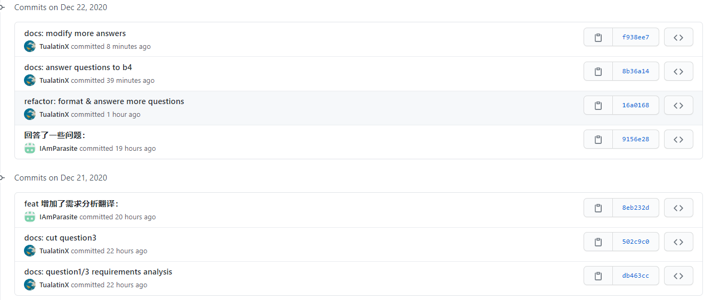
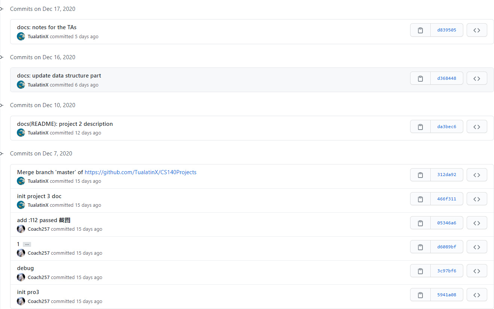
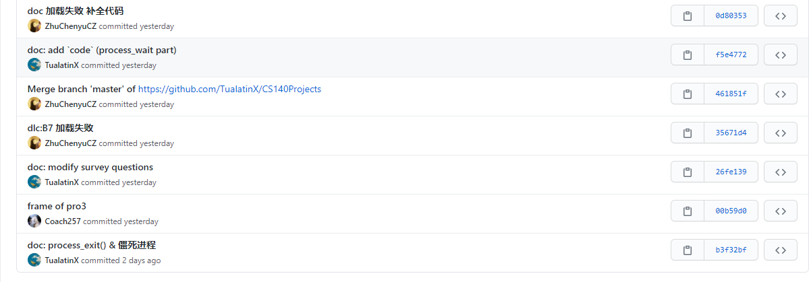
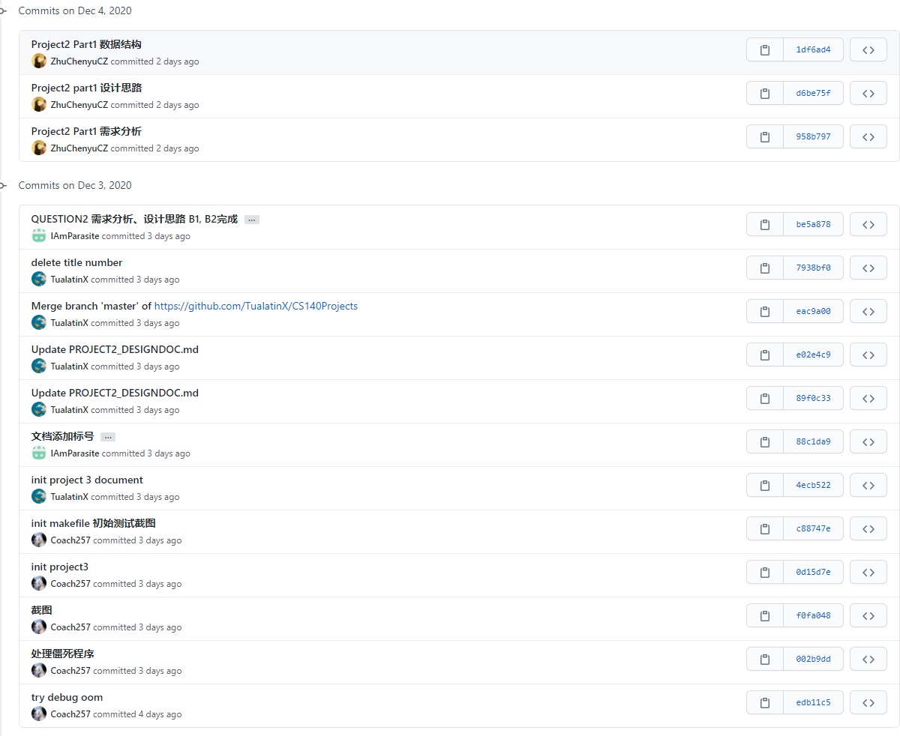

# PROJECT 3: VIRTUAL MEMORY DESIGN DOCUMENT

[TOC]

## 1. GROUP

> Fill in the names and email addresses of your group members.

| NAME | SID | MAIL | RATIO |
| - | - | - | - |
| 朱英豪 | 18373722 | 18373722@buaa.edu.cn | 25% |
| 施哲纶 | 18373044 | 18373044@buaa.edu.cn | 25% |
| 胡鹏飞 | 18373059 | 18373059@buaa.edu.cn | 25% |
| 朱晨宇 | 18373549 | 18373549@buaa.edu.cn | 25% |

> 主要负责内容

| NAME | RESPONSIBLE FOR |
| - | - |
| 朱英豪 | 需求、思路设计；文档编写 |
| 施哲纶 | 具体算法实现；文档审核 |
| 胡鹏飞 | 项目前期调研；理解Pintos |
| 朱晨宇 | 负责Debug，代码风格检查 |

> Github记录

> 样例通过情况

113个测试点中，通过了113-26=87个点（87/113*100%=76.99%）

## 2. PRELIMINARIES

> If you have any preliminary comments on your submission, notes for the TAs, or extra credit, please give them here.

我们该项目的Github仓库为私有仓库，如有需要，请联系我们。

由于我们并未完全实现Project3的所有内容，以下DesignDoc中的问题将非常坦诚地仅回答我们已实现的部分或是对该部分的理解。

需要注意的是，我们的代码**没有参考**任何网络上的现成代码，完全基于我们的Project2项目。

**给助教的提醒：**

- 如果某些组Project2是以方式二形式做的，而以方式一完成了Project3，则我有90%+的把握确信他们是抄的。
- 如果某些组Project3与Project2都以方式一做，然而Project3的代码并不基于Project2（Project2中的实现方式多样——用一个信号量同步/用两个信号量同步/使用管道来同步等，可以看`thread.h`中定义的数据结构），则我同样有90%+的把握确信他们是抄的。

> Please cite any offline or online sources you consulted while preparing your submission, other than the Pintos documentation, course text, lecture notes, and course staff.

1. 操作系统概念(原书第9版)/(美)Abraham Silberschatz等著
2. 原仓周老师PPT中的概念和课上讲解

## 3. 需求分析

### 3.1. 分页部分

为从可执行文件加载的段实现分页。所有这些页面都应延迟加载（Lazily load），即仅在内核拦截它们的页面错误时才加载。在页被逐出后，将已经被修改的页（就像“dirty bit”表示的那样）写入交换页。未经修改的页面（包括只读页面）不应该被写入交换页，因为它们始终可以从可执行文件中读取。

实现类似于LRU（cache replacement algorithms）的全局页面替换算法，该算法是至少是`second chance`算法或者始终轮换算法的简单变体。

设计应考虑并行性。如果一个缺页中断需要I/O资源，与此同时，没有发生缺页中断的进程应继续执行，而其他不需要I/O的页面错误的进程或者发生缺页中断而不需要I/O资源的进程应该能够继续完成。这将需要一些同步工作。

我们需要修改程序加载器的核心，即`userprog/process.c`中`load_segment()`中的循环。每次循环时，`page_read_bytes`都会从可执行文件中读取要读取的字节数，`page_zero_bytes`接受将要下一次字节读取时需要初始化为0的字节格数。这两个总和为`PGSIZE(4,096)`。页面的处理取决于以下变量的值：

- 如果`page_read_bytes`等于`PGSIZE`，则应在首次访问时从基础文件中请求对页面进行分页。
- 如果`page_zero_bytes`等于`PGSIZE`，则完全不需要从磁盘读取也买你，因为它全为零。我们应该通过在首个缺页错误时创建一个由全零组成的新页来处理此类页面。
- 否则，`page_read_bytes`和`page_zero_bytes`都不等于`PGSIZE`。在这种情况下，将从底层文件中读取页面的初始部分，并将其余部分清零。

### 3.2. 栈增长

实现栈增长。在Project 2中，栈仅仅是在用户虚拟内存顶部的单独的一个页面，并且程序也因为这样的栈而受到限制。现在，如果一个栈的大小增长超过了他现在的大小，操作系统应该根据所需分配额外的页。

仅当其他页面“看起来”是堆栈访问时才分配它们。设计一种启发式算法，尝试将堆栈访问与其他访问区分开。

如果一个用户程序在栈指针之下写数据是十分有可能引起BUG的，这是因为经典的真实的操作系统会在任何时候中断一个进程来传递一个在栈中存放数据的信号量。然而，80x86架构在结构上与真实的操作系统不同，会在不同的位置引起缺页中断。

我们需要能够获得用户程序现在的栈指针的值。在一个由用户程序产生的系统调用或者缺页中断中，我们应该能够从储存`intr_frame`的esp寄存器中分别传递`syscall_handler()`或者`page_fault()`。如果在访问他们之前确认用户指针，那么你仅仅需要处理的情况就是这些了。一方面，如果依赖于缺页中断来检测不合法的内存访问，我们需要处理另一种情况，缺页中断发生在内核当中。因为处理器在发生一个异常时保存了栈指针，造成了从用户模式到内核模式的切换，从传递给`page_fault()`的`struct intr_frame`中溢出esp会产生未定义的值，而不是用户堆栈指针。我们需要用另一种方式进行处理，例如在第一次从用户模式转换成内核模式时，将esp寄存器保存在`struct thread`中。

我们应该像大多数操作系统一样对堆栈大小施加一定的绝对限制。某些操作系统使限制可由用户调整，例如在许多Unix系统上使用ulimit命令。在许多GNU/Linux系统上，默认限制为8 MB。

第一个堆栈页面无需延迟分配。我们可以在加载时使用命令行参数来分配和初始化它，而无需等待其出错。

所有堆栈页面都应为驱逐对象。被逐出的堆栈页面应写入交换区，**以实现类似于LRU的算法**。

### 3.3. 内存映射文件

实现内存映射文件，包括以下系统调用：

- 系统调用：`mapid_t mmap (int fd，void *addr)`
  - 将以`file desciption`打开的文件映射到进程的虚拟地址空间。整个文件被映射到从`addr`开始的连续虚拟页面中。
  - 我们的VM系统必须延迟加载mmap区域中的页面，并将mmaped文件本身用作映射的后备存储。也就是说，逐出mmap映射的页面会将其写回到映射的文件中。
  - 如果文件的长度不是`PGSIZE`的倍数，则最终映射页中的某些字节会“伸出”到文件末尾。当页面从文件系统中出现故障时，将这些字节设置为零，而当页面写回到磁盘时将其丢弃。
  - 如果成功，此函数将返回一个“映射ID”，该ID唯一标识进程中的映射。失败时，它必须返回-1，否则不应为有效的映射ID，并且进程的映射必须保持不变。
  - mmap调用有可能因为`file description`打开的文件长度为0失败。如果addr不是页面对齐的，或者映射的页面范围与任何现有的映射页面集（包括堆栈或可执行加载时映射的页面）重叠，则必须失败。如果addr为0，它也必须失败，因为某些Pintos代码假定未映射虚拟页面0。最后，代表控制台输入和输出的文件描述符0和1是不可映射的。
- 系统调用：`void munmap (mapid_t mapping)`
  - 取消由映射指定的映射，该映射必须是由尚未取消映射的同一进程先前调用mmap返回的映射ID。

进程退出时，无论是通过`exit()`还是通过任何其他方式，都将隐式取消对所有映射的映射。当取消映射时，无论是隐式还是显式地，该进程写入的所有页面都将被写回到文件中，而未写入的页面则不能被写入。然后，将页面从进程的虚拟页面列表中删除。

关闭或删除文件不会取消映射任何文件映射。创建后，按照Unix约定，映射将一直有效，直到调用munmap或进程退出为止。我们应该使用`file_reopen`函数为文件的每个映射获取对文件的单独且独立的引用。

如果两个或多个进程映射同一文件，则不要求它们看到一致的数据。Unix通过使两个映射共享相同的物理页面来处理此问题，但是mmap系统调用还具有一个参数，允许客户端指定页面是共享页面还是私有页面（即写时复制）。

### 3.4. 访问用户内存

在处理系统调用时，我们需要调整代码以访问用户内存。就像用户进程可以访问其内容当前位于文件或交换空间中的页面一样，它们也可以将引用此类非驻留页面的地址传递给系统调用。此外，除非内核采取措施防止这种情况发生，否则即使在内核代码正在访问页面的情况下，也可能会将页面从其框架中逐出。如果内核代码访问此类非驻留页面，则将缺页错误。

访问用户内存时，内核必须准备好处理此类页面错误，或者必须防止它们发生。内核在保存处理这些错误所需的资源时，必须防止此类页面错误。在Pintos中，此类资源包括由设备驱动程序获取的锁，这些驱动程序控制包含文件系统和交换空间的设备。举一个具体例子，我们必须防止当一个设备驱动程序获得通过`file_read`传递的用户缓存的时候的发生缺页中中断，因为我们在处理这类错误的时候不能够唤醒驱动程序。

要防止此类页面错误，需要在其中进行访问的代码与页面的逐出代码之间进行协作。例如，可以扩展框架表以记录框架中包含的页面何时不能被驱逐。 （这也称为“固定”或“锁定”其框架中的页面。）固定会限制页面替换算法在寻找要逐出的页面时的选择，所以要确保在不必要的时候不要进行固定处理。

## 4. QUESTION 1: PAGE TABLE MANAGEMENT

### 4.1. DATA STRUCTURES

> A1: Copy here the declaration of each new or changed `struct` or `struct` member, global or static variable, `typedef`, or enumeration.  Identify the purpose of each in 25 words or less.

在本部分中，添加的新的数据结构或者是修改已有的数据结构。有：

**in `thread.h`**

- [NEW] `struct list child_list`
  - 定义子进程列表来储存父进程的所有子进程
- [NEW] `struct list_elem cpelem`
  - 定义`child_list`的`elem`
- [NEW] `tid_t parent_tid`
  - 定义父进程的`tid`

**in `process.c`**

- [CHANGED] `process_execute()`
  - implement starts a new thread running a user program loaded from FILENAME.
- [CHANGED] `start_process()`
  - implement 参数传递

### 4.2. ALGORITHMS

> A2: In a few paragraphs, describe your code for accessing the data stored in the SPT about a given page.

很遗憾，由于我们尚并未完成这一部分。

> A3: How does your code coordinate accessed and dirty bits between kernel and user virtual addresses that alias a single frame, or alternatively how do you avoid the issue?

首先，找到用户进程虚拟地址的页面，通过找到未使用的可用页面，或释放最近未访问过的页面（通过逐出内存中的关联页面）来解决这一个问题。

### 4.3. SYNCHRONIZATION

> A4: When two user processes both need a new frame at the same time, how are races avoided?

当用户进程获取内存时，用锁机制来避免。其中，每一帧都有自己的锁，表示它当前的状态是否被占用。

### 4.4. RATIONALE

> A5: Why did you choose the data structure(s) that you did for representing virtual-to-physical mappings?

在我们的设想中，我们的实现方式足够简约，且相对容易实现。

## 5. QUESTION 2: PAGING TO AND FROM DISK

### 5.1. DATA STRUCTURES

> B1: Copy here the declaration of each new or changed `struct` or `struct` member, global or static variable, `typedef`, or enumeration.  Identify the purpose of each in 25 words or less.

**全局变量**

- [NEW] `struct lock file_lock`
  - 定义文件锁来限制多个线程同时修改同一个文件
- [NEW] `typedef int pid_t`
  - 定义线程标识号的类型
- [NEW] `int fd_num`
  - 定义非负整数file descriptor
- [NEW] `struct fd`
  - 定义新的结构体来表示一个线程打开的文件
- [NEW] `struct thread* parent`
  - 表示线程的父进程

**in `struct thread`**

- [NEW] `struct list fd_list`
  - 表示线程拥有的fd列表
- [NEW] `struct list fd_list`
  - 表示线程拥有的fd列表
- [NEW] `struct list child_status`
  - 表示子进程状态列表
- [NEW] `struct file *execfile`
  - 表示线程正在执行的文件
- [NEW] `struct child_process_status *relay_status`
  - 表示转发给父进程的子进程状态
- [NEW] `struct semaphore sema`
  - 表示子进程等待的信号量

**in `struct child_process_status`**

- [NEW] `struct int ret_status`
  - 表示子进程的返回状态
- [NEW] `struct int tid`
  - 表示子进程的tid
- [NEW] `struct thread* child`
  - 表示指向子进程的指针
- [NEW] `bool finish`
  - 表示子进程是否完成的状态
- [NEW] `bool iswaited`
  - 表示子进程是否等待的状态
- [NEW] `bool loaded`
  - 表示子进程是否等待的状态
- [NEW] `struct list_elem elem`
  - 表示子进程状态结构体的列表元素

### 5.2. ALGORITHMS

> B2: When a frame is required but none is free, some frame must be evicted.  Describe your code for choosing a frame to evict.

首先，我们的算法应该找到所有未曾使用的页。如果所有页面都已经被使用过（已存在映射），那么算法应该保证能够驱逐出一个页面，使得我们的页帧可以被使用。

我们将最近的未被访问的第一帧作为被替换的对象。

如果通过遍历，发现所有的帧最近都已被访问过，则重复遍历，直至出现有效帧。

> B3: When a process P obtains a frame that was previously used by a process Q, how do you adjust the page table (and any other data structures) to reflect the frame Q no longer has?

在选择Q的帧时，我们可以知道它所映射的用户虚拟地址，从而获得Q进程的数据结构。通过`pagedir_clear_page()`方法删除对该Q frame的引用。

> B4: Explain your heuristic for deciding whether a page fault for an invalid virtual address should cause the stack to be extended into the page that faulted.

要防止此类页错误，需要做一些检查：考察esp-32处。当发现此类错误时，我们认为，可以扩展页框来解决。

### 5.3. SYNCHRONIZATION

> B5: Explain the basics of your VM synchronization design. In particular, explain how it prevents deadlock.  (Refer to the textbook for an explanation of the necessary conditions for deadlock.)

很遗憾，由于我们尚并未完全完成这一部分。在我们的设想中，frame table和swap table之间都会有锁。当页驱逐时，各个进程都可能会用到这些表，因此需要在这些表中记录，并对内容进行同步。

> B6: A page fault in process P can cause another process Q's frame to be evicted.  How do you ensure that Q cannot access or modify the page during the eviction process?  How do you avoid a race between P evicting Q's frame and Q faulting the page back in?

我们试图为每个补充页表创建锁。当进程Q的页帧的驱逐之前，会根据其Dirty Bit写或者不写入到可执行文件中。在被驱逐之后，我们会在扩展表中表及进程的PID用以表示哪个进程正在使用页帧，当请求修改的进程的PID与表中不一致的时候就会拒绝修改。

> B7: Suppose a page fault in process P causes a page to be read from the file system or swap.  How do you ensure that a second process Q cannot interfere by e.g. attempting to evict the frame while it is still being read in?

很遗憾，由于我们尚并未完全完成这一部分。在我们的设想中，通过为frame table entry创建一个是否可以撤销属性来记录其状态：当将要从文件系统中读取或交换时，设为false，当被判断为false时，防止其被evict。

> B8: Explain how you handle access to paged-out pages that occur during system calls.  Do you use page faults to bring in pages (as in user programs), or do you have a mechanism for "locking" frames into physical memory, or do you use some other design?  How do you gracefully handle attempted accesses to invalid virtual addresses?

很遗憾，由于我们尚并未完全完成这一部分。在我们的设想中，我们认为，可以通过增加判别位作标记来解决。如页面的逐出标记的true和false可在检查时被得知，当进程看到这些标志时便会去考虑是否要evict。

对于无效地址，和Project2一样，我们选择对地址进行预检查，如果不符合要求，则拒绝访问，适时退出。

### 5.4. RATIONALE

> B9: A single lock for the whole VM system would make synchronization easy, but limit parallelism.  On the other hand, using many locks complicates synchronization and raises the possibility for deadlock but allows for high parallelism. Explain where your design falls along this continuum and why you chose to design it this way.

我们做Pintos的实验理念是简洁、结构清晰、易实现，因此在我们的设想中，选择使用单个锁来做同步，尽管牺牲了一定的并行性，但我们认为是可以接受的。

## 6. SURVEY QUESTIONS

Answering these questions is optional, but it will help us improve the course in future quarters. Feel free to tell us anything you want--these questions are just to spur your thoughts. You may also choose to respond anonymously in the course evaluations at the end of the quarter.

> In your opinion, was this assignment, or any one of the three problems in it, too easy or too hard?  Did it take too long or too little time?

这个作业对我们而言非常难。我们基本上整整10天其他什么作业都没做，只用来理解和写Pintos。

> Did you find that working on a particular part of the assignment gave you greater insight into some aspect of OS design?

是的。虚拟内存这一概念的引入与设计，通过这一实验过程，并结合原老师的非常非常生动的讲解，有了更深的认识。

> Is there some particular fact or hint we should give students in future quarters to help them solve the problems?  Conversely, did you find any of our guidance to be misleading?

实验指导书已经足够明确，我们组在做本次Project 3的唯一参考就是该实验指导书。

> Do you have any suggestions for the TAs to more effectively assist students, either for future quarters or the remaining projects?

希望助教能给我们更多的指导，比如在开始的时候带领我们理解一下实验的任务要求，代码方面的虚拟内存相关的知识背景，以及核心代码的部分讲解。

> Any other comments?

感谢在实验过程中解答我们问题的每一位助教！
